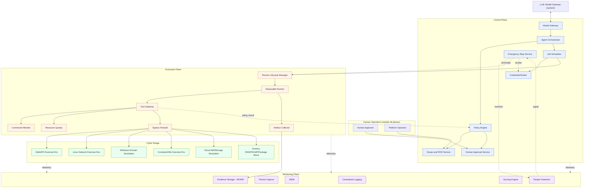
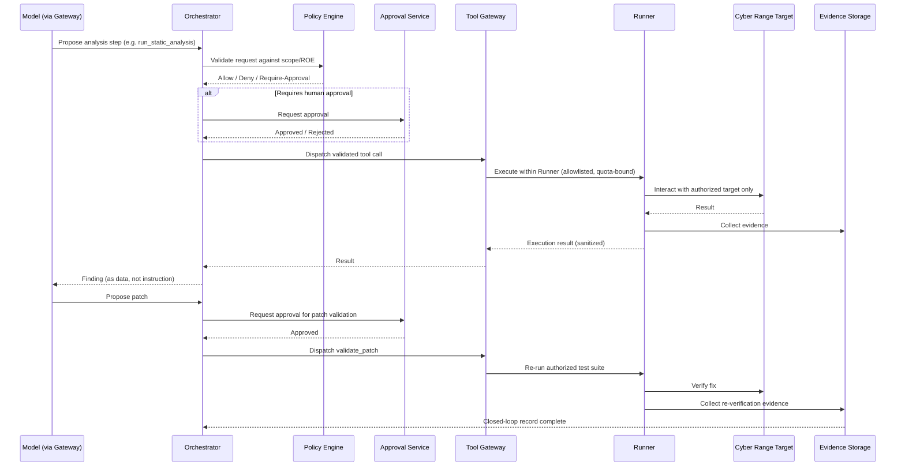

# Architecture

Status: draft. This document is the second of the two foundational documents (alongside `docs/security/trust-boundaries.md`) that most other design artifacts in this repository depend on. Read `AGENTS.md` and `docs/security/trust-boundaries.md` first.

## 1. Scope of this document

This describes the overall system architecture: the four trust planes, their components, how they communicate, and the core control loop (find → verify → propose fix → re-verify). It does not repeat the trust-boundary rules in detail — see `docs/security/trust-boundaries.md` for those — but shows how components are arranged within and across those boundaries.

## 2. System context

Two coupled systems, one repository:

- **Cyber-evaluation system**: an LLM-assisted agent (behind a Model Gateway) that analyzes, plans, reviews evidence, and proposes patches, with all scope/authorization/execution decisions enforced outside the model.
- **Cyber range**: a disposable, fully synthetic set of target environments the evaluation system is authorized to test, with no route to real infrastructure.

## 3. Component responsibilities

### 3.1 Control Plane

| Component | Responsibility | Explicitly does not |
|---|---|---|
| Agent Orchestrator | Coordinates the model's turn-by-turn workflow (plan → request tool → receive result → continue) | Execute anything directly against range/execution plane |
| Scope and ROE Service | Serves the current engagement's signed Scope and Rules-of-Engagement manifest | Allow the model or any automated caller to modify the manifest |
| Policy Engine | Evaluates every tool-call request against scope, permissions, expiry, rate/concurrency limits, approval requirements | Trust an engagement/scope claim it hasn't independently validated |
| Human Approval Service | Manages the approval workflow and state for state-changing/exploit-validation actions | Auto-approve; accept approval from the model itself |
| Credential Broker | Issues short-lived, target-scoped, single-job credentials | Expose long-lived secrets to the model's context, environment variables, or files |
| Job Scheduler | Dispatches approved jobs to a fresh disposable Runner | Dispatch a job the Policy Engine has not approved |
| Emergency Stop Service | Independently triggerable termination of any job/engagement | Depend on the model or the execution plane to function |
| Model Gateway | Sole interface between the LLM and the rest of the system; exposes only the narrow typed functions (task brief §5) | Accept raw IPs/URLs/shell strings from the model for unconditional execution |

### 3.2 Execution Plane

| Component | Responsibility | Explicitly does not |
|---|---|---|
| Disposable Runner | Executes one job's authorized actions in isolation | Persist state across jobs; retain credentials after job completion |
| Tool Gateway | Receives typed function calls, validates against Policy Engine before any range-facing action | Execute anything the Policy Engine has not authorized for this specific call |
| Command Allowlist | Enumerates permitted commands/operations per tool/profile | Allow arbitrary command-string composition |
| Resource Quotas | Enforces CPU/memory/time/request-rate/data-volume limits per job | Allow a job to exceed its allocated envelope |
| Egress Firewall | Default-deny network egress from Runners, allowlisting only in-range destinations | Allow reachability to the general internet, corporate networks, cloud metadata, Docker socket, or K8s management API outside narrowly scoped, explicitly authorized scenario needs |
| Artifact Collector | Gathers evidence (logs, screenshots, network captures, findings) from a job | Modify or delete evidence once collected; write back into the control plane's decision state |
| Runner Lifecycle Manager | Creates and destroys Runners idempotently, on schedule or on Emergency Stop signal | Allow a Runner to outlive its job or engagement |

### 3.3 Cyber Range

| Component | Responsibility |
|---|---|
| Web/API Exercise Environment | Synthetic web/API targets with intentionally reproducible, catalogued vulnerabilities |
| Linux Network Exercise Environment | Synthetic Linux hosts/network segments |
| Windows Domain Simulation | Synthetic Active-Directory-style domain |
| Container/Kubernetes Exercise Environment | Synthetic container and orchestration targets |
| Cloud IAM/Storage Simulation | Synthetic cloud-style IAM and storage misconfigurations |
| Dummy DNS/PKI/IdP/Package Mirror | Range-internal substitutes so exercises never need real internet-facing services |
| Scenario creation/init/teardown mechanism | Builds and fully destroys a scenario's resources per engagement |

### 3.4 Monitoring Plane

| Component | Responsibility |
|---|---|
| Centralized Logging | Aggregates logs from all other planes |
| Packet Capture | Independent network-level observation, primarily within the range and at its boundary |
| Process Tree / File Diff Monitoring | Detects unexpected process spawning, privilege escalation, or file tampering inside Runners/range hosts |
| OpenTelemetry / Metrics | Operational and security telemetry across all planes |
| SIEM | Correlates events across sources; can feed stop-condition detection |
| Tamper Detection | Detects attempts to alter audit records, disable monitoring, or modify Policy Engine/Scope files |
| Scoring Engine | Scores both the target system (findings quality) and the AI agent (scope adherence, evidence quality, safety) |
| Evidence Storage (WORM) | Append-only, independently held store for all evidence and audit records |

## 4. The core control loop

Per AGENTS.md ("discovery → verification → remediation proposal → re-verification closed loop") and task brief §8 ("発見、検証、修正、再検証の閉ループ"):

## 5. Design principles applied throughout

Restated from AGENTS.md and mapped to where they are enforced:

- **Default deny** → Tool Gateway, Egress Firewall, Policy Engine (§3.1–3.2)
- **Least privilege** → Credential Broker issues single-job, single-target credentials only
- **Complete mediation** → every tool call passes Policy Engine, not just the first per session
- **Fail closed** → any Policy Engine, Scope Service, or Approval Service unavailability blocks the action rather than defaulting to allow
- **Separation of duties** → four independent planes (`docs/security/trust-boundaries.md`)
- **Defense in depth** → Command Allowlist + Resource Quotas + Egress Firewall + Policy Engine all independently gate the same action
- **Compartmentalization** → no shared credentials/IAM/network/hosts across planes
- **Disposability** → Runners and range scenarios are destroyed after each job/engagement (`docs/design/reset-and-destruction.md`, pending)
- **Auditability/attributability** → every action traceable to engagement, scenario, target, tool, model version, policy decision, approval decision (Monitoring Plane, one-way from other planes)

## 6. What this document does not cover

Deferred to their own documents (see `docs/exec-plans/active/phase-01-design.md` work-item table for status):

- Detailed network zones and allow/deny matrix → `docs/security/network-matrix.md`
- IAM model per plane → `docs/security/iam-model.md`
- Credential lifecycle detail → `docs/security/credential-model.md`
- Threat actors and attack scenarios → `docs/security/threat-model.md`
- API/interface schemas → `docs/design/api-boundaries.md`, `schemas/`
- State machines (approval, job, credential lifecycle) → `docs/design/state-machines.md`
- Scoring methodology → `docs/design/scoring.md`
- Reset/destruction procedures → `docs/design/reset-and-destruction.md`
- Technology choices (isolation tech, policy engine, IaC tool, etc.) → `docs/adr/`
