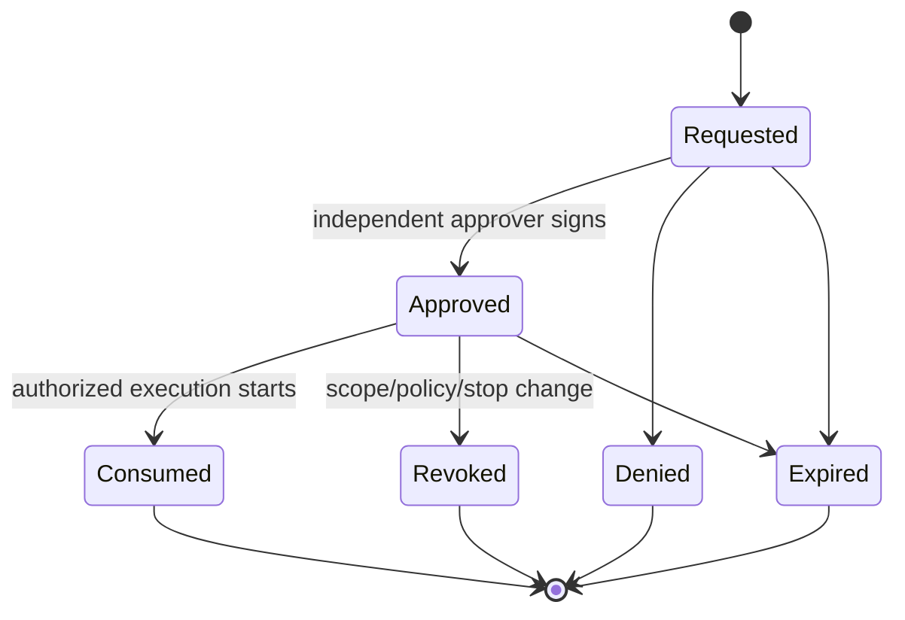

# State Machines

## Engagement

`draft -> validated -> approved -> active -> stopping -> closed`

Any state may transition to `terminated` after an emergency stop. Changes to scope or ROE create a new immutable version and return to `draft`.

## Approval

## Job

`requested -> policy_pending -> approval_pending? -> authorized -> provisioning -> ready -> running -> collecting -> destroying -> completed`

Failure transitions:

- any pre-run state -> `denied` or `expired`;
- running -> `quarantined` on stop condition;
- quarantined -> `collecting` -> `destroying` -> `terminated`;
- lifecycle failure -> `failed`, with emergency cleanup still required.

## Runner

`absent -> creating -> attested -> networked -> active -> isolated -> destroyed`

A runner cannot move from `isolated` back to `active`; a new runner is required.
