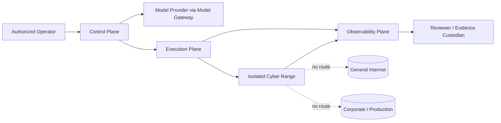
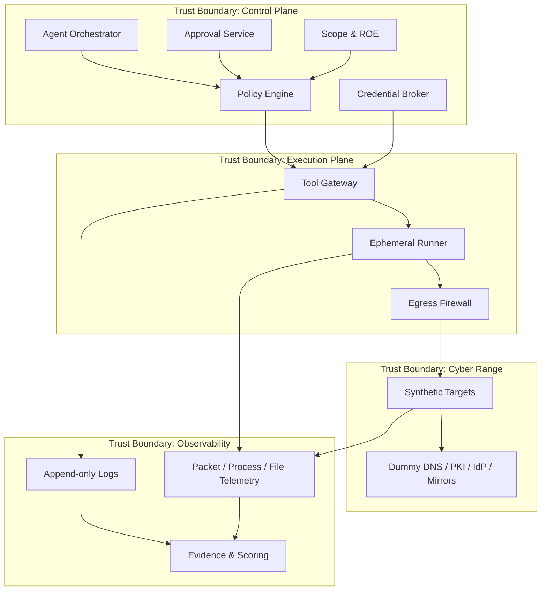
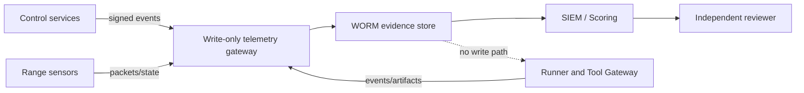

# Data-Flow Diagrams

## Context diagram

```mermaid
flowchart LR
  Operator[Authorized Operator] --> CP[Control Plane]
  CP --> MG[Model Provider via Model Gateway]
  CP --> EP[Execution Plane]
  EP --> CR[Isolated Cyber Range]
  EP --> OP[Observability Plane]
  CR --> OP
  OP --> Reviewer[Reviewer / Evidence Custodian]
  CR -. no route .-> Internet[(General Internet)]
  CR -. no route .-> Corp[(Corporate / Production)]
```

## Trust-boundary DFD

```mermaid
flowchart TB
  subgraph TB1[Trust Boundary: Control Plane]
    S[Scope & ROE]
    P[Policy Engine]
    A[Approval Service]
    O[Agent Orchestrator]
    C[Credential Broker]
  end
  subgraph TB2[Trust Boundary: Execution Plane]
    T[Tool Gateway]
    R[Ephemeral Runner]
    F[Egress Firewall]
  end
  subgraph TB3[Trust Boundary: Cyber Range]
    X[Synthetic Targets]
    I[Dummy DNS / PKI / IdP / Mirrors]
  end
  subgraph TB4[Trust Boundary: Observability]
    L[Append-only Logs]
    N[Packet / Process / File Telemetry]
    E[Evidence & Scoring]
  end
  O --> P --> T
  A --> P
  S --> P
  C --> T
  T --> R --> F --> X
  X --> I
  T --> L
  R --> N
  X --> N
  L --> E
  N --> E
```

## One-way audit flow

```mermaid
flowchart LR
  CP[Control services] -->|signed events| GW[Write-only telemetry gateway]
  EP[Runner and Tool Gateway] -->|events/artifacts| GW
  CR[Range sensors] -->|packets/state| GW
  GW --> WORM[WORM evidence store]
  WORM --> SIEM[SIEM / Scoring]
  SIEM --> Reviewer[Independent reviewer]
  WORM -. no write path .-> EP
```

Standalone diagram sources are under `diagrams/`.
